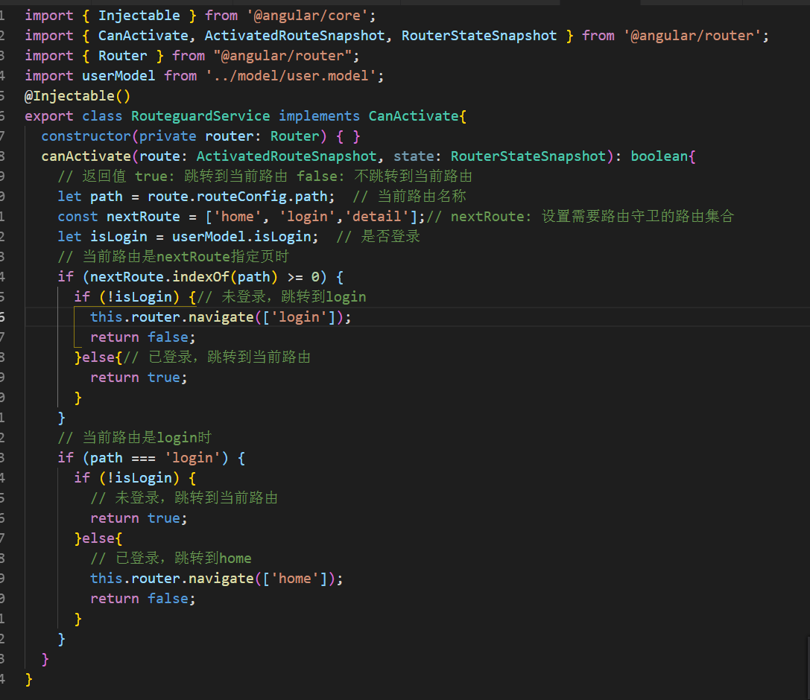
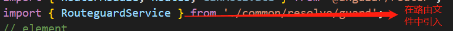
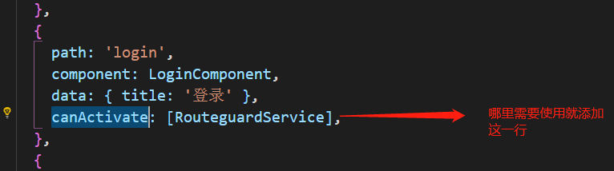
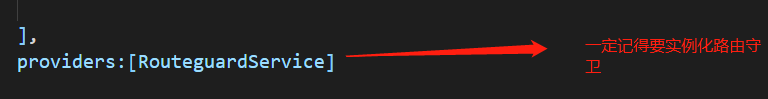
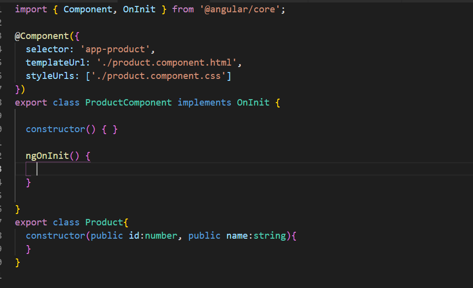
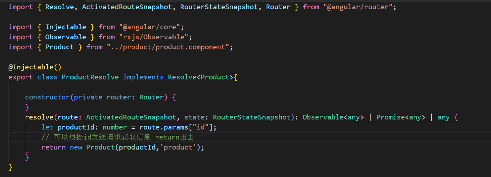

 ## 路由
 ### 路由配置
 ```bash
   <base href="/"> '在index.html的 <head> 标签下先添加一个 <base> 元素，来告诉路由器该如何合成导航用的 URL。'

   import { RouterModule, Routes } from '@angular/router';'导入router相关模块'

   const appRoutes: Routes = [
    { path: 'hero/:id',component: HeroDetailComponent 
      children:[
          {
            path:'',
            component: component,
          },
          {
            path: 'details/:id',
            component: component,
          }
        ]
    },'可以用路由传值形如  hero/789'
    { path: 'heroes',component: HeroListComponent,data: { title:      'Heroes List' } 'data属性存储数据的，'
    },
    { path: '','根路径'
        redirectTo: '/heroes',
        pathMatch: 'full'
    },
    { path: '**', component: PageNotFoundComponent }'404路由没匹配上'
    ];'路由不能有 / 开头'
    <router-outlet></router-outlet> '路由器出口'
    '说明:如果有子路由跳转要用 ./ 表示子路由' <el-button [routerLink]="['./details',id]"  routerLinkActive="active" type="text" size="small">详情</el-button>
 ```
 ### 路由导航
 ```bash
   1.  <a routerLink="/heroes" routerLinkActive="active">Heroes</a> '这种静态路由不需要传值的'
   2. <el-button [routerLink]="['/singerDetail']" [queryParams]="{id:id}" routerLinkActive="active" 
      type="text" size="small" (click)="handle(scope,2)">详情</el-button>
      'url路径 /singerDetail?id=xxxxxx'
   this.singerId = this.routerInfo.snapshot.queryParams['id'];'组件中取值'
   3. <el-button [routerLink]="['/singerDetail',id]"  routerLinkActive="active" type="text" size="small">详情</el-button>
    'url路径: /singerDetail/xxxxx;注意:这种情况路由中路径设置必须 singerDetail/:id  否则无法匹配无法跳转'
    this.singerId = this.routerInfo.snapshot.params['id'];'组件中取值'
    '以上是在模板中绑定跳转'

   4. this.router.navigate(['/singerDetail'],{queryParams:{ id: this.id }}); 'js跳转，和2效果相同组件中取值也是一样'
      this.router.navigate(['/singerDetail',this.id]);'这个和3效果相同，路由配置也必须一样'
    '说明: snapshot快照模式，假如你很确定这个组件的实例永远、永远不会被复用，那就可以使用快照，
      但是：假如在同一个组件有两个按钮都是去到商品详情点击了第一个按钮并且这个组件没有销毁的情况
      下再点击第二个该按钮不会重新创建这个组件的实例的情况下，只是数据传递的不同，这种情况下要使
      用订阅模式(subscribe)'
   
   '以下是两种订阅模式'
   this.routerInfo.queryParams.subscribe((params:ParamMap)=>{
      this.singerId = params["id"]
    })'这个对应  /singerDetail?id=xxxxxx'

    this.routerInfo.params.subscribe((params:ParamMap)=>{
      this.singerId = params["id"]
    }) '这个对应  /singerDetail/xxxxxx'
    '这两个必须对应，否则取不到传的参数'
 ```
 ### 路由守卫(生命周期钩子)
1. CanActivate: 处理导航到某个路由的情况（进入路由时触发事件）；

2. CanDeactivate: 处理从当前路由离开时的情况（离开当前路由时触发事件）;

3. Resolve: 在路由激活之前获取路由数据（预加载数据）；
   

以下为例
CanActivate
守卫文件  guard.ts 如下图


路由文件


使用


最后一定要在路由文件中实例化路由守卫


CanDeactivate 和上面基本相同不再介绍

Resolve
例如：查看商品详情时，预先根据该商品id查询返回数据；防止进入商品组件时获取数据延迟而出现页面空白的情况




```bash
 resolve:{ //resolve是一个对象， 用法都一样
      product : ProductResolve   //想传入product,product由ProductResolve生成
 }},'在app.route.module路由文件中使用，最后记得实例化 ProductResolve'
 ```
