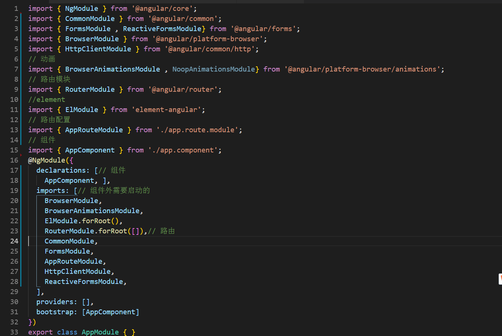

## 从app.module.ts说起


### NgModules模块
***
NgModule 是一些带有 @NgModule 装饰器的类。@NgModule 装饰器的 imports 数组会告诉 Angular 哪些其它的 NgModule 是当前模块  所需的，一般都是在imports数组中放置一些内置模块以及服务。
***
### CommonModule模块
***
CommonModule 导出所有基本的 Angular 指令和管道  NgIf(判断)、NgForOf(循环，也可用NgFor)、NgClass(添加删除css类)、NgStyle(修改样式)、NgSwitch(和NgIf类似) 等指令(还有更多)，以及一些 CurrencyPipe(数字转金额),DatePipe(日期格式化),DecimalPipe(数字转字符串) 等管道。
***
### FormsModule , ReactiveFormsModule模块
***
FormsModule 许多和表单相关的指令，后面会详细介绍，
ReactiveFormsModule 构建响应式表单，封装了根据规则提示的表单，后面详细介绍。
***
### BrowserModule模块
***
BrowserModule 运行在浏览器中必须的模块
***
### HttpClientModule模块
***
HttpClientModule 和服务器通讯的模块，一般是封装在单独的文件中
***
### BrowserAnimationsModule , NoopAnimationsModule模块
***
BrowserAnimationsModule 开启动画 NoopAnimationsModule 关闭动画
***
### RouterModule模块
***
RouterModule 路由相关模块
***

### 从最简单的说起
1. 插值表达式
```bash
 <p>My current hero is {{name}}</p>
 
 <p>The sum of 1 + 1 is not {{1 + 1 + getVal()}}</p>
```
 支持简单的表达式，不支持赋值运算符，位运算，自增自减等比较复杂的
2. 事件绑定
```bash
  <button (click)="deleteHero()">Delete</button>
  <button (click)="onSave($event)">Save</button> '$event事件对象'
  <input [value]="currentHero.name" (input)="currentHero.name=$event.target.value" >

  
```
 和vue差不多，其实很多框架都比较类似，当然也可以用bind-、on-、bindon-前缀绑定
3. 数据绑定
```bash
  
    '属性绑定等价与上面'
  <button [disabled]="isUnchanged">Save</button> '属性绑定'
  <div [ngClass]="{'special': isSpecial}"></div> '类绑定不会覆盖已有的类，只会添加或删除当前类'
  <input [(ngModel)]="name"> '双向绑定，官方叫她' >>盒子里放香蕉
  <button [attr.aria-label]="help">help</button> '自定义属性等'
  <div [class.special]="isSpecial">Special</div> 'css类名不会覆盖已有的类'
  <button [style.color]="isSpecial ? 'red' : 'green'"> '行内样式'
  <button [style.font-size.em]="isSpecial ? 3 : 1" >Big</button>
  <button [style.font-size.%]="!isSpecial ? 150 : 50" >Small</button>
  <app-hero-detail [hero]="currentHero"></app-hero-detail> '组件传值，方括号一定要有，否则就是字符串了'
  <div class="bad curly special" [class]="badCurly">Bad curly</div> 
  '官方说badCurly有或无会覆盖原有的类 亲测在有[class.special]，[ngClass]同时存在的情况下不会覆盖'

  <p> is the <i>interpolated</i> image.</p>
  <p> is the <i>property bound</i> image.</p>
   '上面和下面这两种数据绑定作用相同'
  <p><span>"{{title}}" is the <i>interpolated</i> title.</span></p>
  <p>"<span [innerHTML]="title"></span>" is the <i>property bound</i> title.</p>
```
  模板绑定是通过 property 和事件来工作的(官方介绍的比较详细可以去看官方文档)
4. 结构模板指令
```bash
  <div *ngIf="isActive">{{hero.name}}</div>
  <app-hero-detail *ngIf="isActive"></app-hero-detail> 'if判断，必须带*号'
  <div *ngFor="let hero of heroes">{{hero.name}}</div>
  <app-hero-detail *ngFor="let hero of heroes" [hero]="hero"></app-hero-detail>'循环'
  <div *ngFor="let hero of heroes; let i=index">{{i + 1}} - {{hero.name}}</div>'带索引的 必须声明i否则拿不到索引'


  <el-menu default-active="1" class="el-menu-vertical-demo" theme="dark">
        <el-submenu *ngFor="let menu of menuList" [title]="menu.title">
          <ng-container *ngIf = "menu.hasChildren;else menuBlock">
              <el-menu-item-group   *ngFor="let subMenu of menu.subs" >
                 <el-submenu [title]="subMenu.title">
                    <el-menu-item *ngFor="let subsMenu of subMenu.subMenu" [to]="subsMenu.index">{{subsMenu.title}}</el-menu-item>
                 </el-submenu>
              </el-menu-item-group>
          </ng-container>
            <ng-template #menuBlock>
                <el-menu-item  *ngFor="let subMenu of menu.subs" [to]="subMenu.index">{{subMenu.title}}</el-menu-item>
            </ng-template>
        </el-submenu>
    </el-menu>
  '在这种循环和判断的模块中一个元素不能有多个块，上面这个例子，
  也就是不能把ngIf和ngFor放在同一个元素上否则报错，if判断的else语句使用要用#后面用else的部分'


  <div *ngFor="let hero of heroes; trackBy: trackByHeroes">
    ({{hero.id}}) {{hero.name}}
  </div> 'trackBy有点像vue中key但是要声明才能使用'
  
  <div [ngSwitch]="currentHero.emotion">
        <app-happy-hero    *ngSwitchCase="'happy'"    [hero]="currentHero"></app-happy-hero>
        <app-sad-hero      *ngSwitchCase="'sad'"      [hero]="currentHero"></app-sad-hero>
        <app-confused-hero *ngSwitchCase="'confused'" [hero]="currentHero"></app-confused-hero>
        <app-unknown-hero  *ngSwitchDefault           [hero]="currentHero"></app-unknown-hero>
  </div> 'ngSwitch指令和js一样的写法'

  <input #phone placeholder="phone number"> '模板变量可以在其他位置拿到这个元素，以#或者ref声明这个变量'
  <button (click)="callPhone(phone.value)">Call</button>'模板变量作用整个模板作用域和循环let声明是不同的'
   
```
5. 管道操作符
```bash
  <div>Title through uppercase pipe: {{title | uppercase}}</div> '用法|后面跟名字即可'
  <div>Title through a pipe chain:{{title | uppercase | lowercase}}</div>'可以有多个'
  <div>Birthdate: {{currentHero?.birthdate | date:'longDate'}}</div>'传值'
  <div>{{currentHero | json}}</div>  '调试可以输出整个对象，数组'
  <div>The name is {{nullHero?.name}}</div> '安全操作符，当对象nullHero为null时不会报错，
  这点比vue做的好，当然也可以多级像a?.b?.c?.d这样多级判断'
  <div>
    The  marker is {{$any(hero).marker}}
  </div> '类型转换函数没用过暂时还不是很清楚，官方说防止类型转换错误'
```


 

