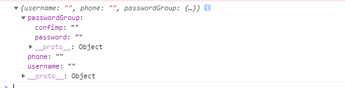

### angular表单
***
  注意:看到很多模板变量报错的，form表单的模块一定要引入正确，在app.module模块引入并不等于全局模式，所以在引入组件的地方一定引入表单的模块,我是在路由模块引入的，因为我的组件多数都在路由文件中；记得不要放在app.module哪个组件需要form模块，就在引入组件的地方引入下面的模块，最后在元数据中imports
  ```bash
   import { FormsModule,ReactiveFormsModule } from '@angular/forms';
  ```
***
1. 模板驱动表单(FormsModule)
   angular封装了处理了表单，这里form和原生的不太一样,表单是经过处理的，不会刷新页面
   ```bash
     <form #myForm='ngForm' (ngSubmit)="onSubmit(myForm.value)"   novalidate >
     '这里的模板变量必须是ngForm，表单的内容会以对象的形式挂载在模板变量的value上'
        <div class="form-content">
          <div class="form-group" >
            用户名<input type="text" ngModel name='username' id="username"  
            //'使用ngModel双向绑定数据，必须要有name属性，这个也是挂载模板变量身上的属性名'
            class="form-control input-underline input-lg"  minlength="4" required 
             placeholder="username" #username="ngModel"> '这里的模板变量可以作为提示的判断'
          </div>
          <div [hidden]="username.valid || username.pristine" //'这个是根据模板变量#username="ngModel" 拿到的值 可作为提示用'
                class="alert alert-danger">
              username is required
            </div>
          <div class="form-group" >
            手机号<input type="text" id="mobeil" ngModel name='phone' 
             class="form-control input-underline input-lg"  minlength="4"  
             placeholder="Password" >
          </div>
          <div ngModelGroup="passwordGroup">// 'ngModelGroup是用来分组的，可以把多个分成一组放在myForm.value对象的一个属性上'
            <div class="form-group" >
              密码<input type="password" id="password" ngModel name='password'
                class="form-control input-underline input-lg"  minlength="4" 
                 placeholder="Password" >
            </div>
            <div class="form-group" >
              确认密码<input type="password" id="cpassword" ngModel name='confimp' 
               class="form-control input-underline input-lg"  minlength="4"  
               placeholder="Password" >
            </div>
          </div>
          <button type="submit" class="btn rounded-btn" >Log in</button>
        </div>
      </form>
   ```
   对象的形式
   
 模板表单有三个主要的指令 表单的变量 #myForm='ngForm' ngForm不可变， ngModel 双向数据绑定，记得name属性
   ngModelGroup="passwordGroup" 这个分组用，个人感觉用处不大。

2. 响应式表单(ReactiveFormsModule)
 demo-template中
 ```bash
  <form [formGroup]="myform" (ngSubmit)="onSubmit()">'视图和myform关联'
        <div class="form-content">
          <div class="form-group" >
            用户名<input type="text" formControlName="username"  id="username"  class="form-control input-underline input-lg"  minlength="4" required  placeholder="Username" > '使用formControlName绑定字段'
          </div>
          <div class="form-group" >
            手机号<input type="text" id="mobeil" formControlName='phone'  class="form-control input-underline input-lg"  minlength="4"  placeholder="Password" >
          </div>
          <div class="form-group" formArrayName='emails'> '使用formArrayName分组数据'
            <ul>
              <li *ngFor="let email of myform.get('emails').controls; let i=index">'获取数组数据并循环'
                邮箱-{{i+1}} <input type="text" [formControlName]='i'  > </li> '利用索引绑定数据，记得用[],不知道为什么一会要用[]其他又不用，不得不吐槽一下这个坑爹的angular！！！'
            </ul>
            <button (click)="addEmail()">add</button>
          </div>
            <div formGroupName='confirm'>'分组'
              <div class="form-group" >
                密码<input type="password" id="password" formControlName='password'  class="form-control input-underline input-lg"  minlength="4"  placeholder="Password" >
              </div>
              <div class="form-group" >
                确认密码<input type="password" id="cpassword" formControlName='confimp'  class="form-control input-underline input-lg"  minlength="4"  placeholder="Password" >
              </div>
            </div>
          <button type="submit" class="btn rounded-btn" >Log in</button>
        </div>
   </form>
 ```
 组件中
 ```bash
   1. import {FormBuilder, FormControl, FormGroup, FormArray,Validators} from '@angular/forms';
      '引入'
   2. public myform = new FormGroup({
                username: new FormControl(),
                phone: new FormControl(),
                confirm:new FormGroup({
                password: new FormControl(),
                confimp: new FormControl(),
                }),
                emails:new FormArray([
                new FormControl(),
                ])
            });
        '声明'
   3. onSubmit(){
        console.log(this.myform.value);
      } 
      '数据挂载this.myform.value，是对象形式'
   4. addEmail(){
        let emails = this.myform.get('emails') as FormArray;
        emails.push(new FormControl())
      }  
     '这个感觉也是蛮坑的，获取emails数据不能直接取，要用这种方式！！！' 
 ```
***
  还有很多内容，包括表单校验，FormBuilder服务，校验的内置方法规则，以及自定义校验规则，
  但整体感觉相当繁琐，一点都不实用，这里就不做过多介绍，可以去官方文档研究！
  吐槽一下官方文档：文档内容不是很清晰，坑很多，试错成本较大，而且没有常见问题的说明，个人觉得文档很糟糕！！！
***
   


   
